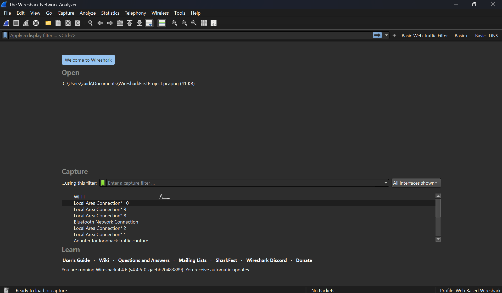
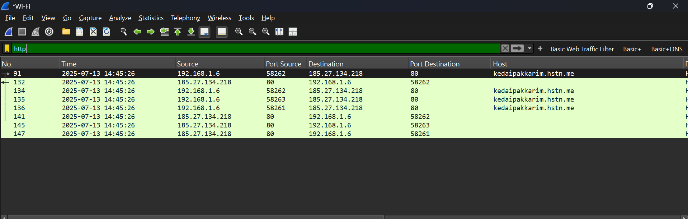
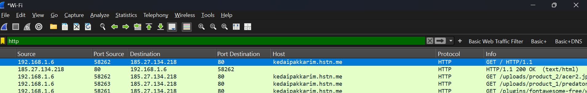
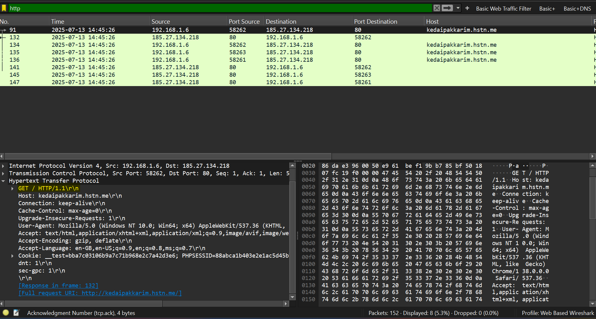
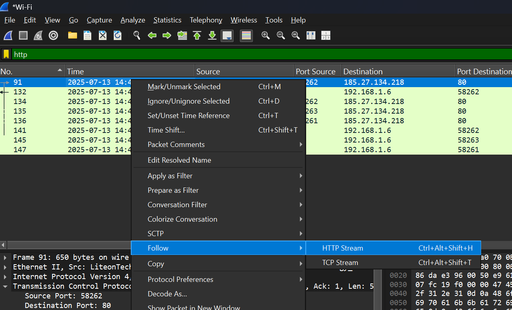
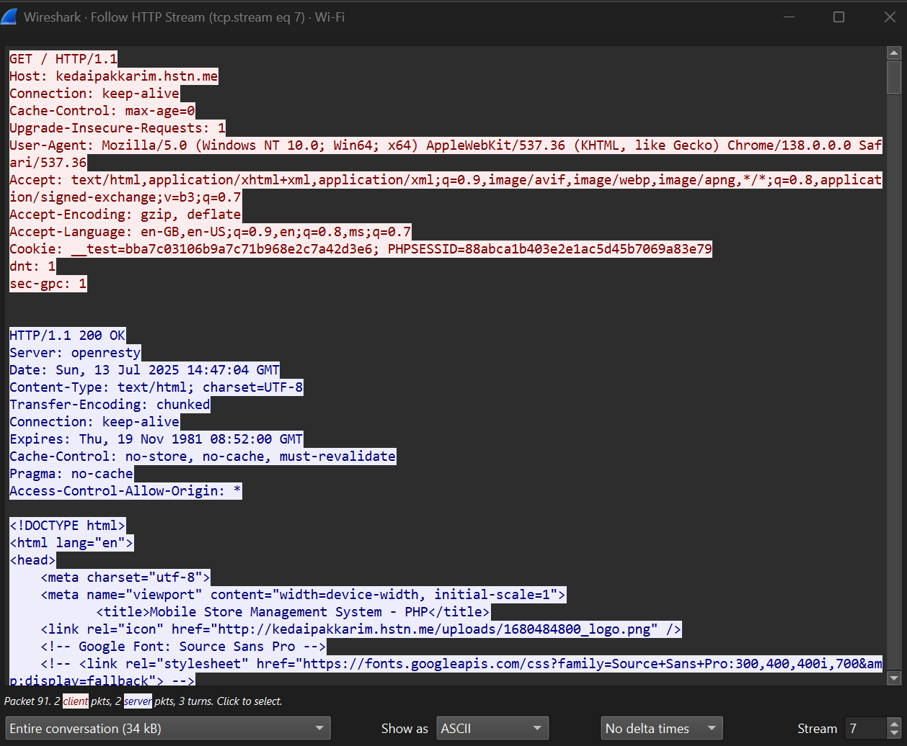

# 🕵️‍♂️ Analyzing HTTP Traffic with Wireshark

## 📝 Introduction

In this project, you'll use **Wireshark** to capture and analyze **HTTP traffic**. This is essential for:
- Understanding how web communications work
- Spotting potential security issues
- Investigating anomalies in network traffic

---

## 🧠 Pre-requisites

- Basic understanding of networking concepts
- Wireshark installed: [https://www.wireshark.org/download.html](https://www.wireshark.org/download.html)
- Any modern web browser (Chrome, Firefox, etc.)

---

## 🔧 Lab Setup & Tools

- **Wireshark**
- **Web Browser**

---

## 🧪 Exercises

---

### 🔍 Exercise 1: Capture HTTP Traffic

**Step-by-Step Instructions:**
1. Open Wireshark.
2. Select the network interface that connects to the internet.
3. Click on the **"Start Capture"** button (blue shark fin).
4. Open your browser and go to: [http://kedaipakkarim.hstn.me](http://kedaipakkarim.hstn.me/)
5. Let the page load completely.
6. Stop the capture by clicking the **red square** icon.

**📸 Screenshot:**

Figure 1: Launch Wireshark  

Figure 2: Captured HTTP traffic showing a successful HTTP 200 OK response with content type text/html  

 
  
**✅ Expected Output:**
> The capture file that I provided contains multiple packets, including TCP packets with HTTP GET requests and HTTP responses such as HTTP/1.1 200 OK. These packets correspond to communications with a known HTTP site, for example, http://kedaipakkarim.hstn.me. This confirms that the network traffic includes standard HTTP request-response exchanges, which can be identified and analyzed within the capture.

---

### 🔍 Exercise 2: Filter HTTP Traffic

**Step-by-Step Instructions:**
1. In Wireshark, locate the filter bar at the top.
2. Enter the filter: `http`
3. Press Enter to apply.

**📸 Screenshot:**

Figure 3:  HTTP Traffic Captured After Applying Filter in Wireshark  

**✅ Expected Output:**
>The capture file should contains only HTTP packets, which helps isolate and identify web-related traffic. This includes HTTP GET requests and their corresponding response headers, making it easier to analyze the HTTP communication without unrelated protocol noise.

---

### 🔍 Exercise 3: Analyze HTTP GET Requests

**Step-by-Step Instructions:**
1. In the filtered traffic, find a packet labeled `GET`.
2. Click it to view details.
3. Expand the **“Hypertext Transfer Protocol”** section.
4. Observe the requested URL, headers, and parameters.

**📸 Screenshot:**

Figure 4: Analyzing an HTTP GET Request in Wireshark After Applying Filter  

**✅ Expected Output:**
> The packet shown is an HTTP GET request sent from the client to the server. The Host header specifies the target domain (kedaipakkarim.hstn.me), and the User-Agent header reveals the browser and operating system used by the client. Additional headers such as Accept, Accept-Encoding, and Connection give insight into the types of content the client is willing to receive and how it wants to manage the connection. These details are critical for understanding client behavior and HTTP request structure in network analysis.

---

### 🔍 Exercise 4: Analyze HTTP Responses

**Step-by-Step Instructions:**
1. Locate the response packet tied to the `GET` request.
2. Click to expand the “Hypertext Transfer Protocol” section.
3. Examine the status code, headers, and content type.

**📸 Screenshot:**

Figure 5: HTTP Response with Status Code 200 OK and HTML Content  

**✅ Expected Output:**
> The packet shown is an HTTP response to a previous GET request. The status line HTTP/1.1 200 OK indicates that the server successfully handled the request. The Content-Type: text/html; charset=UTF-8 header confirms that the server returned an HTML document. Other headers like Server: openresty and Transfer-Encoding: chunked provide more information about the server type and how the response body is delivered. This confirms a successful and properly formatted response from the server.

---

### 🔍 Exercise 5: Extract and Examine Payload Data

**Step-by-Step Instructions:**
1. Right-click the response packet.
2. Select **Follow > TCP Stream**.
3. View the full HTTP conversation in the stream window.

**📸 Screenshot:**

Figure 6: Initiating TCP Stream View from HTTP Response Packet  

Figure 7: TCP Stream View from HTTP Response Packet 

**✅ Expected Output:**
> The full HTTP conversation is successfully displayed, showing both the client's GET request and the server's HTTP/1.1 200 OK response. The payload contains HTML content, including metadata such as page title and icon references. This confirms that the server returned a valid HTML web page in response to the client's request. Using Follow TCP Stream helps visualize complete data exchange, including headers and body, making it easier to analyze web traffic and inspect transferred content.

---

## ✅ Conclusion

By completing these exercises, I learned how to:
- Capture and filter HTTP traffic using Wireshark to isolate web-related packets
- Analyze web requests and responses
- Gained hands-on experience with packet analysis tools critical for network monitoring

These skills are foundational for SOC analysts, network investigators, and penetration testers.
